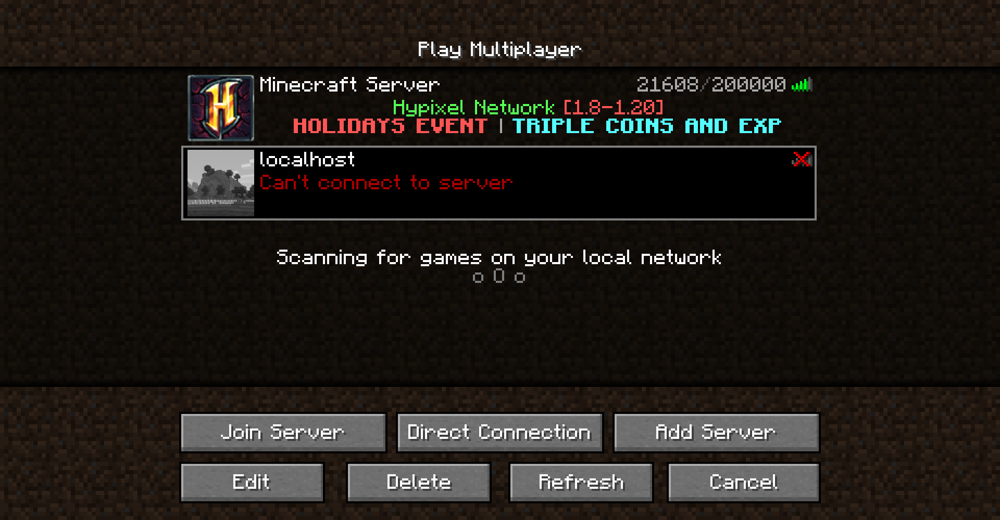
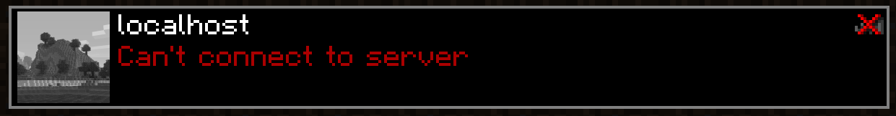
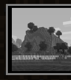
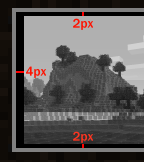
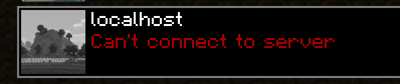

# List Entry Highlight Fix
Fix potential misalignment of list entry border in Minecraft.  
Available for Fabric 1.19 - 1.20.

## What?
Consider the following:  

Now look at the selected row:

Do you see it?

 

Now that you can't un-see it, this mod fixes that:

So it always aligns neatly ^w^  
~~mojang pls fix~~

## License
This project is licensed under the [MIT License](LICENSE)